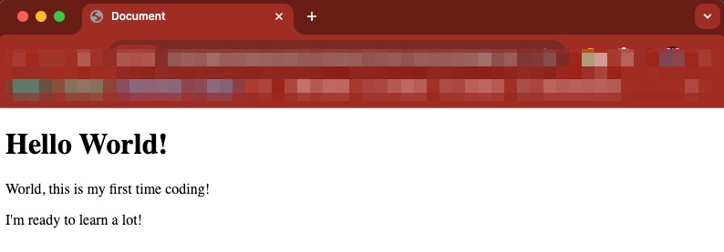

# HTML Elements and Tags Lab 1

## Description 📄
This lab introduces you to the fundamental building blocks of HTML webpages. You'll experiment with creating a simple webpage structure and observe how basic code translates into visual elements on a web page.

---

## Acceptance Criteria 📋
1. **File Navigation:** Navigate to index.html.
2. **Boilerplate Generation:** Use shortcuts to generate HTML boilerplate.
3. **Header Tag Insertion:** Insert appropriate header tag based on its function.
4. **Paragraph Tags Insertion:** Insert a paragraph tags with the given copy.

---

## ToDo list ✅
**Attention**: When you complete a task, put an `x` in the middle of the brackets to mark it off your ToDo list.

1. [x] Navigate to the `index.html` file. 
2. [x] In line 1, type an exclamation point, wait to see the prompt, then hit `enter`.
3. [x] Inside the body tag, put the appropriate header tag for a main header with the copy: 
   `Hello World!`
4. [x] Under that, put a paragraph tag under that and copy and paste:
    `World, this is my first time coding!`
5. [x] Write another paragraph tag under the previous and copy and pastethis copy:
   `I'm ready to learn a lot!`

🎊 **Fantastic work! You just finished your first ever HTML coding lab.** 🎊

---
