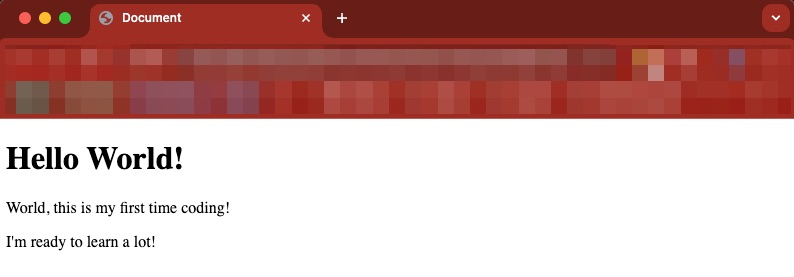
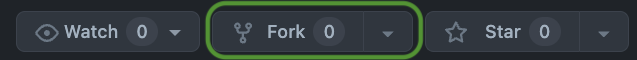
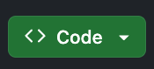
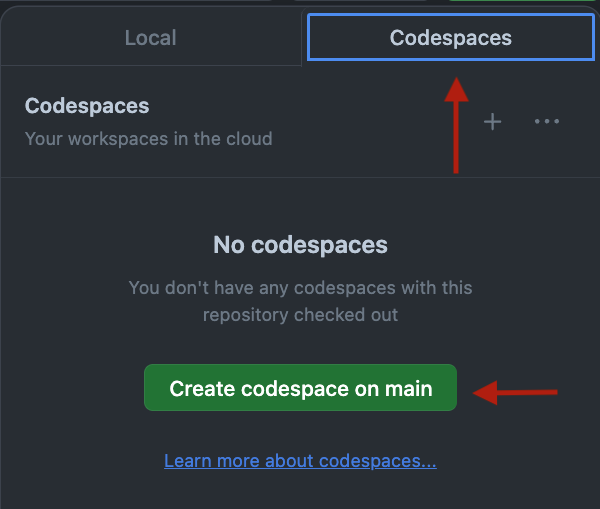
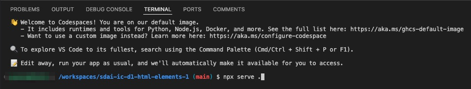
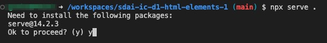
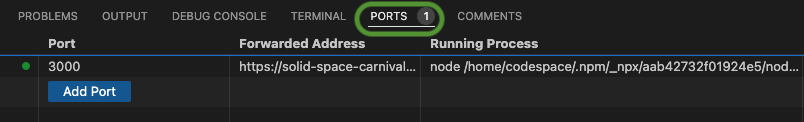

# HTML Elements and Tags Lab 1

## Description 📄
This lab introduces you to the fundamental building blocks of HTML webpages. You'll experiment with creating a simple webpage structure and observe how basic code translates into visual elements on a web page.

---

## Developer Objectives 📋
1. **File Navigation:** Navigate to index.html.
2. **Boilerplate Generation:** Use shortcuts to generate HTML boilerplate.
3. **Header Tag Insertion:** Insert appropriate header tag based on its function.
4. **Paragraph Tags Insertion:** Insert a paragraph tags with the given copy.

---

## Setup Instructions for Codespaces 🛠️
#### Forking the Repository
1. Click the Fork button at the top-right of the repository page to create a copy under your GitHub account.

#### Open Codespaces:
2. Wait for the Code button to appear on your forked repository page.

1. Click the Code button and select Open with Codespaces.

#### Starting the Development Server (Port)
1.  In the terminal, type the following command to start the server: `npx serve .`

1. When prompted, type y and press return / enter.

#### Open the Webpage:
1. Navigate to the Ports section where the terminal is.

1. Click on the globe icon to open the webpage and render your code.
   

---

## ToDo list ✅
**Attention**: When you complete a task, put an `x` in the middle of the brackets to mark it off your ToDo list.

1. [ ] Navigate to the `index.html` file. 
2. [ ] In line 1, type an exclamation point, wait to see the prompt, then hit `enter`.
3. [ ] Inside the body tag, put the appropriate header tag for a main header with the copy: 
   `Hello World!`
4. [ ] Under that, put a paragraph tag under that and copy and paste:
    `World, this is my first time coding!`
5. [ ] Write another paragraph tag under the previous and copy and pastethis copy:
   `I'm ready to learn a lot!`

🎊 **Fantastic work! You just finished your first ever HTML coding demo.** 🎊

---

## ATTENTION 

### Solution codebase 👀
🛑 **Only use this as a reference** 🛑

💾 **Not something to copy and paste** 💾

**Note:**  This lab references a solution file located [here](https://github.com/HackerUSA-CE/sdai-ic-d1-html-elements-1/blob/demo-solution/index.html) (link not shown).
